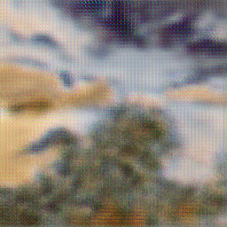

# Cycle-Gan

Image to Image translation using Cycle Generative Adversarial Networks. Implemented Cycle GANs paper by Jun-Yan Zun, Taesung Park, Philip Isola, and Alexei A. Efros. The paper implemented [paper](https://arxiv.org/pdf/1703.10593.pdf). Worked on Apples and Oranges Eminist Dataset.
No. of Iterations = 1019
No. of Epochs = 2 (Training the model took a lot of computational time and power)

Apple to Orange after 2 epochs.

PyTorch - Python library for developing and training neural networks based on Deep Learning models. Pytorch was used as the primary library for building models.

